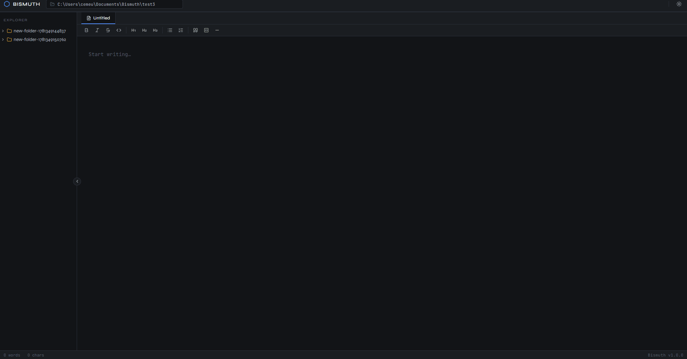

 
<h1 align="center">
   Bismuth
</h1>  

<p align="center">
  <b>A lightweight, local-first developer workspace for notes, terminal workflows, and structured thinking.</b>
</p>

<p align="center">
  <i>Notes. Files. Terminal. One workspace.</i>
</p>

<p align="center">

[](https://github.com/CBYeuler/Bismouth/actions)
[](https://github.com/CBYeuler/Bismouth/releases)
[](https://github.com/CBYeuler/Bismouth/releases)
[](LICENSE)
[](https://github.com/CBYeuler/Bismouth/commits/main)
[](#)
[](#)
[](https://tauri.app)
[](https://developer.mozilla.org)


</p>


## Overview

**Bismuth** is a minimal but powerful desktop application designed for structured note-taking, workspace organization, and developer productivity.

It combines:

* Markdown-based notes
* Workspace-based file organization
* A terminal-ready environment 
* Fast, local filesystem-first architecture

The goal is to provide a clean, distraction-free environment for developers and technical users who want full control over their data.



---
<p align="center">A filesystem-native workspace for developers who prefer convenience and <em>control<em> </p>

---


---

## Features
###  Implemented (v1 Frontend)

* Markdown note editor (vanilla JS prototype)
* Collapsible sidebar navigation
* Dark / Light mode support
* Basic workspace UI structure
* Clean, minimal UI layout
* Tauri integration (completed shell migration)
* Workspace CRUD operations
* Note persistence (filesystem-based)
* PTY terminal integration


### Planned

* File tree explorer
* Graph view (note linking visualization)
* Export system (PDF / Markdown / HTML)
* Advanced workspace management
* Search indexing

---
<h1 align="center">Architecture</h1>

<p align="center">
  Bismuth follows a <em>local-first filesystem-based design</em>.
</p>

<p align="center">
<pre>
Workspace/
├── notes/
├── assets/
└── exports/
</pre>
</p>

<p align="center">
Each workspace is a self-contained directory on the user’s machine.
</p>

## Tech Stack

* **Frontend:** React
* **Desktop Runtime:** Tauri
* **Backend:** Rust (filesystem + process management)
* **Terminal:** PTY integration (xterm.js + backend bridge planned)

---

##  Design Philosophy

* Local-first (no cloud dependency)
* User owns all data
* Minimal overhead
* Fast startup & performance-focused
* Extensible architecture for developer workflows

---

## Motivation

Most note-taking apps are either:

* Too heavy and cloud-dependent
* Too simple and not developer-friendly
* Locked into proprietary ecosystems

Bismuth aims to sit in between:

> A developer workspace where notes, files, and terminal workflows coexist.

---

## Screenshots


---

## Getting Started

### Prerequisites

- [Node.js](https://nodejs.org/) v18+
- [Rust](https://www.rust-lang.org/tools/install) (latest stable)
- [Tauri CLI](https://tauri.app/start/prerequisites/)

On Linux you'll also need:
```bash
sudo apt install libwebkit2gtk-4.1-dev libappindicator3-dev librsvg2-dev patchelf
```
**On Windows:**
- [Microsoft Visual Studio C++ Build Tools](https://visualstudio.microsoft.com/visual-cpp-build-tools/) — select "Desktop development with C++" workload
- WebView2 is pre-installed on Windows 10/11. If missing: [download here](https://developer.microsoft.com/en-us/microsoft-edge/webview2/)

### Installation

```bash
# Clone the repo
git clone https://github.com/CBYeuler/Bismouth.git
cd Bismouth/my-tauri-app

# Install dependencies
npm install

# Run in development mode
npm run tauri dev
```

### Build for production

```bash
npm run tauri build
```

---

## Project Structure

```
Bismuth/
├── src/                    
│   ├── App.jsx          
│   ├── index.css            
│   ├── main.jsx          
│   ├── assets/           
│   ├── components/
│   ├── lib/
│   ├── pages/             
│   └── context/           
│
└── src-tauri/              # Tauri / Rust backend
    ├── src/
    │   ├── main.rs         
    │   ├── lib.rs          # Cargo lib entry point
    │   └──  ....        
    ├── Cargo.toml
    └── tauri.conf.json
```
```
src-tauri/src/
├── main.rs       
├── lib.rs                 
├── commands/         
│   ├── mod.rs
│   ├── workspace.rs      
│   ├── notes.rs         
│   ├── filesystem.rs    
│   └── terminal.rs     
├── models/               
│   ├── mod.rs
│   ├── workspace.rs       
│   ├── note.rs           
│   └── response.rs        
├── services/             
│   ├── mod.rs
│   ├── workspace_service.rs    
│   ├── note_service.rs        
│   ├── filesystem_service.rs   
│   └── terminal_service.rs     
├── utils/                 
│   ├── mod.rs
│   ├── error.rs            
│   ├── path.rs            
│   └── config.rs          
└── build.rs
```
---

##  Roadmap

* [x] Vanilla JS UI prototype
* [x] Tauri migration
* [x] Workspace CRUD
* [x] Note persistence
* [x] PTY terminal
* [ ] File tree explorer
* [ ] Graph view
* [ ] Export system

---

##  Contributing

This project is currently in early development. Contributions, ideas, and feedback are welcome once the core architecture stabilizes.

---

##  License

This project is licensed under the MIT License.

See the full license text in the [LICENSE](LICENSE) file.

---

## Status

Early-stage active development — architecture evolving rapidly.
